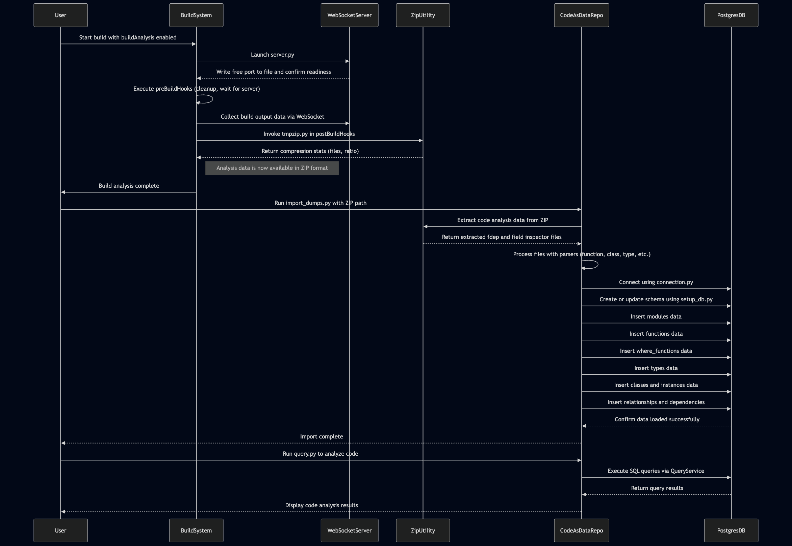
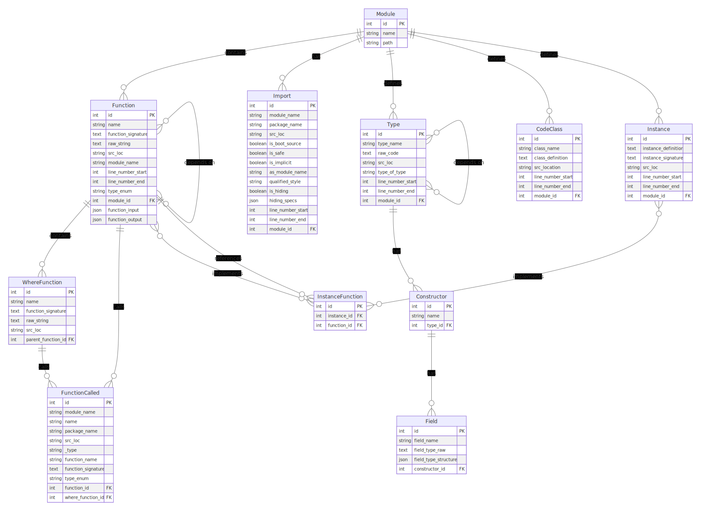

# Code Analysis Tool

A powerful tool for analyzing code structure and relationships in large Haskell codebases.

## Overview

This tool parses data generated by the GHC Plugin Fdep , extracts structural information (functions, types, classes, imports, etc.), and stores it in a PostgreSQL database for efficient querying and analysis. It's designed to help developers understand complex codebases by enabling exploration of function call graphs, dependency relationships, and code patterns.



## Features

- **Parse and analyze code structure**: Extract functions, types, classes, imports, and instances from source code
- **Database storage**: Store code structure in a PostgreSQL database for efficient querying
- **Function call graphs**: Analyze function dependencies and call hierarchies
- **Module relationships**: Understand dependencies between modules
- **Advanced queries**: Find complex patterns and relationships in your code
- **High performance**: Uses optimized bulk loading and parallel processing for handling large codebases

## Setup

### Prerequisites

- Haskell code base
- Data generated by this plugin <https://github.com/juspay/spider/tree/ghc-9.2.8/fdep>
- Python 3.10+
- PostgreSQL database

### Installation

1. Clone the repository:

   ```bash
   git clone https://github.com/juspay/code-as-data.git
   cd code-as-data
   ```

NOTE: if you have nix just run `nix develop` and jump to step 6

2. Install dependencies:

   ```bash
   pip install -r requirements.txt
   ```

3. Install the package in development mode:

   ```bash
   pip install -e .
   ```

4. Create a PostgreSQL database:

   ```bash
   createdb code_as_data
   ```

5. Set environment variables in a `.env` file:

   ```
   DB_USER=postgres
   DB_PASSWORD=postgres
   DB_HOST=localhost
   DB_PORT=5432
   DB_NAME=code_as_data
   DB_POOL_SIZE=10
   DB_MAX_OVERFLOW=20
   DB_POOL_TIMEOUT=30
   DB_POOL_RECYCLE=1800
   ```

6. Set up the database schema:

   ```bash
   python scripts/setup_db.py
   ```

## Usage

### Importing Code Data

To import code analysis data into the database:

```bash
python scripts/import_dumps.py /path/to/fdep_output
```

The `--clear` flag will clear existing data before importing.

### Querying the Database

Use the query script to explore code structure:

```bash
# List all modules
python examples/query.py list-modules

# Show module details
python examples/query.py module "module.name"

# Show function details
python examples/query.py function "functionName" --module "module.name"

# Show type details
python examples/query.py type "TypeName" --module "module.name"

# Find most called functions
python examples/query.py most-called --limit 20

# Generate function call graph
python examples/query.py call-graph "functionName" "module.name" --depth 3

# Search for functions containing specific patterns
python examples/query.py search "pattern"
```

## Using as a Library

### Class Reference

#### Database Models

**Module Class (`src.db.models.Module`)**

- Represents a code module in the database
- Relationships:
  - `functions`: Associated functions
  - `imports`: Import statements
  - `types`: Type definitions
  - `classes`: Class definitions
  - `instances`: Type instances

**Function Class (`src.db.models.Function`)**

- Represents a function definition
- Key attributes:
  - `name`: Function name
  - `function_signature`: Type signature
  - `raw_string`: Original code
  - `src_loc`: Source location
- Relationships:
  - `module`: Parent module
  - `where_functions`: Nested functions
  - `called_functions`: Functions this function calls
  - `called_by`: Functions that call this function

**Type Class (`src.db.models.Type`)**

- Represents a type definition
- Key attributes:
  - `type_name`: Name of the type
  - `raw_code`: Original type definition
  - `type_of_type`: Category (DATA, SUMTYPE, TYPE, NEWTYPE, CLASS, INSTANCE)
- Relationships:
  - `module`: Parent module
  - `constructors`: Type constructors
  - `dependent_types`: Types that depend on this type

**Constructor Class (`src.db.models.Constructor`)**

- Represents a data constructor for a type
- Relationships:
  - `type`: Parent type
  - `fields`: Constructor fields

**Class Class (`src.db.models.Class`)**

- Represents a class definition
- Key attributes:
  - `class_name`: Name of the class
  - `class_definition`: Original code

**Import Class (`src.db.models.Import`)**

- Represents an import statement
- Key attributes:
  - `module_name`: Module being imported
  - `package_name`: Package name
  - `qualified_style`: Import style

**Instance Class (`src.db.models.Instance`)**

- Represents a type instance
- Relationships:
  - `module`: Parent module
  - `instance_functions`: Functions in this instance

#### Parsers

**FunctionParser (`src.parsers.function_parser.FunctionParser`)**

- Methods:
  - `load_all_files()`: Load all function definitions
  - `get_functions()`: Get all parsed functions as domain objects
  - `_process_module_data()`: Process function data for a module
  - `_deduplicate_functions_called()`: Remove duplicate function calls

**TypeParser (`src.parsers.type_parser.TypeParser`)**

- Methods:
  - `load()`: Load all type definitions
  - `process_single_module()`: Process types for a single module
  - `_load_raw_code_file()`: Load raw type code
  - `_load_type_file()`: Parse type information

**ClassParser (`src.parsers.class_parser.ClassParser`)**

- Methods:
  - `load()`: Load all class definitions
  - `process_single_class_module()`: Process a single class module
  - `_process_class_data()`: Process individual class data

**ImportParser (`src.parsers.import_parser.ImportParser`)**

- Methods:
  - `load()`: Load all import statements
  - `process_single_module()`: Process imports for a module
  - `get_imports_for_module()`: Get imports for a specific module

**InstanceParser (`src.parsers.instance_parser.InstanceParser`)**

- Methods:
  - `load_all_files()`: Load all instance definitions
  - `process_single_module()`: Process a single module's instances
  - `find_functions_by_line()`: Find functions within a line range

#### Services

**QueryService (`src.services.query_service.QueryService`)**

- Core query methods:
  - `get_all_modules()`: Get all modules
  - `get_module_by_name()`: Find module by name
  - `get_functions_by_module()`: Get all functions in a module
  - `get_function_by_name()`: Find functions by name
  - `get_function_details()`: Get detailed information about a function
  - `get_most_called_functions()`: Find most frequently called functions

- Advanced query methods:
  - `execute_advanced_query()`: Run complex queries with joins and conditions
  - `pattern_match()`: Find patterns in code
  - `find_similar_functions()`: Find functions similar to a reference
  - `find_code_patterns()`: Find recurring code patterns
  - `group_similar_functions()`: Group functions by similarity
  - `find_cross_module_dependencies()`: Analyze module dependencies
  - `analyze_module_coupling()`: Measure coupling between modules
  - `find_complex_functions()`: Identify complex functions
  - `execute_custom_query()`: Run raw SQL queries

**DumpService (`src.services.dump_service.DumpService`)**

- Methods:
  - `insert_data()`: Main method to process and insert all data
  - `process_functions()`: Process function data
  - `process_classes()`: Process class data
  - `process_imports()`: Process import data
  - `process_types()`: Process type data
  - `process_instances()`: Process instance data
  - `extreme_parallel_processing()`: Process data in parallel
  - `prepare_database()`: Prepare database for high-speed inserts
  - `execute_bulk_load()`: Perform bulk loading of data

### Basic Usage

```python
from src.db.connection import SessionLocal
from src.services.query_service import QueryService

# Create a database session
db = SessionLocal()

try:
    # Initialize the query service
    query_service = QueryService(db)
    
    # Get all modules
    modules = query_service.get_all_modules()
    
    # Get functions for a module
    module = query_service.get_module_by_name("your.module.name")
    if module:
        functions = query_service.get_functions_by_module(module.id)
        
    # Get function details
    function = query_service.get_function_by_name("functionName", module.id)[0]
    details = query_service.get_function_details(function.id)
    
    # Find the most called functions
    top_functions = query_service.get_most_called_functions(limit=10)
    
finally:
    db.close()
```

### Example Queries

Here are some common query patterns for analyzing code structure:

### Finding Functions by Name Pattern

```python
# Find all functions with names containing "Handler"
functions = db.query(Function).filter(Function.name.like("%Handler%")).all()
```

### Finding Functions that Call a Specific Function

```python
# Find functions that call a function named "processData"
from sqlalchemy.orm import aliased

Caller = aliased(Function)
Callee = aliased(Function)

functions = (
    db.query(Caller)
    .join(function_dependency, Caller.id == function_dependency.c.caller_id)
    .join(Callee, function_dependency.c.callee_id == Callee.id)
    .filter(Callee.name == "processData")
    .all()
)
```

### Finding Functions by Module

```python
# Find all functions in a specific module
module = db.query(Module).filter(Module.name == "your.module.name").first()
functions = db.query(Function).filter(Function.module_id == module.id).all()
```

### Finding Types Used in a Function

```python
# Find types used in a function's signature
function = db.query(Function).filter(Function.name == "someFunction").first()
if function and function.function_signature:
    # This is a simplified approach - a real implementation would need to
    # parse the signature more carefully
    types = db.query(Type).filter(
        Type.type_name.in_([
            t.strip() for t in function.function_signature.split("->")
        ])
    ).all()
```

### Finding Modules that Import a Specific Module

```python
# Find modules that import a specific module
modules = (
    db.query(Module)
    .join(Import)
    .filter(Import.module_name == "target.module.name")
    .all()
)
```

## Advanced Queries

The `QueryService` provides powerful advanced query capabilities through a flexible query language that lets you express complex relationships and patterns in your code.

### Query Language Overview

The advanced query system is based on a structured JSON format that can express:

- Conditions on entity attributes
- Joins between related entities
- Nested relationships
- Complex patterns

### Supported Operators

The query language supports the following operators:

| Operator     | Description           | Example                                                                        |
| ------------ | --------------------- | ------------------------------------------------------------------------------ |
| `eq`         | Equal to              | `{"field": "name", "operator": "eq", "value": "processData"}`                  |
| `ne`         | Not equal to          | `{"field": "type_enum", "operator": "ne", "value": "where_function"}`          |
| `gt`         | Greater than          | `{"field": "line_number_start", "operator": "gt", "value": 100}`               |
| `lt`         | Less than             | `{"field": "line_number_end", "operator": "lt", "value": 200}`                 |
| `ge`         | Greater than or equal | `{"field": "line_number_start", "operator": "ge", "value": 100}`               |
| `le`         | Less than or equal    | `{"field": "line_number_end", "operator": "le", "value": 200}`                 |
| `like`       | SQL LIKE              | `{"field": "name", "operator": "like", "value": "%Handler%"}`                  |
| `ilike`      | Case-insensitive LIKE | `{"field": "name", "operator": "ilike", "value": "%handler%"}`                 |
| `in`         | In a list             | `{"field": "name", "operator": "in", "value": ["init", "setup", "configure"]}` |
| `not_in`     | Not in a list         | `{"field": "name", "operator": "not_in", "value": ["private", "internal"]}`    |
| `contains`   | Contains substring    | `{"field": "raw_string", "operator": "contains", "value": "error handling"}`   |
| `startswith` | Starts with           | `{"field": "name", "operator": "startswith", "value": "get"}`                  |
| `endswith`   | Ends with             | `{"field": "name", "operator": "endswith", "value": "Handler"}`                |
| `between`    | Between values        | `{"field": "line_number_start", "operator": "between", "value": [100, 200]}`   |
| `is_null`    | Is null               | `{"field": "function_signature", "operator": "is_null", "value": true}`        |

### Advanced Query Examples

```python
from src.db.connection import SessionLocal
from src.services.query_service import QueryService

db = SessionLocal()

try:
    query_service = QueryService(db)
    
    # Example 1: Find functions with names containing "Handler" that call a function named "processData"
    query = {
        "type": "function",
        "conditions": [
            {"field": "name", "operator": "like", "value": "%Handler%"}
        ],
        "joins": [
            {
                "type": "called_function", 
                "conditions": [
                    {"field": "name", "operator": "eq", "value": "processData"}
                ]
            }
        ]
    }
    
    results = query_service.execute_advanced_query(query)
    
    # Example 2: Find functions in a specific module that are called by functions in other modules
    query = {
        "type": "function",
        "conditions": [
            {"field": "module_id", "operator": "eq", "value": 42}
        ],
        "joins": [
            {
                "type": "calling_function",  # Functions that call this function
                "conditions": [
                    {"field": "module_id", "operator": "ne", "value": 42}  # Different module
                ]
            }
        ]
    }
    
    results = query_service.execute_advanced_query(query)
    
    # Example 3: Find type definitions used by functions with high complexity
    query = {
        "type": "type",
        "joins": [
            {
                "type": "function",
                "conditions": [
                    # Join with functions that use this type and have complex implementation
                    {"field": "raw_string", "operator": "contains", "value": "case"},
                    {"field": "raw_string", "operator": "contains", "value": "where"}
                ]
            }
        ]
    }
    
    results = query_service.execute_advanced_query(query)
    
    # Example 4: Find large functions (by line count) that call many different functions
    # This example combines multiple conditions and complex relationship criteria
    query = {
        "type": "function",
        "conditions": [
            # Functions with more than 50 lines
            {"field": "line_number_end", "operator": "gt", "value": 0},  # Must have valid line numbers
            {
                "field": "line_number_end", 
                "operator": "gt", 
                "value": "function.line_number_start + 50"  # Pseudo-code, actual implementation would use raw SQL
            }
        ],
        "joins": [
            {
                "type": "called_function",
                "conditions": [],  # No specific conditions on called functions
                # The query service counts these relationships automatically
            }
        ]
    }
    
    # For this specific example, you might need a custom method:
    complex_functions = query_service.find_complex_functions(
        complexity_threshold=15,  # Combined score from metrics
        min_lines=50,            # Minimum lines of code
        min_dependencies=10      # Minimum number of function calls
    )
    
finally:
    db.close()
```

### Pattern Matching

The pattern matching system allows you to search for specific code structures and relationships:

```python
# Example 1: Find call relationships (function A calls function B)
pattern = {
    "type": "function_call",
    "caller": "process",  # Function names containing "process"
    "callee": "validate", # Function names containing "validate"
    "mode": "calls"       # Direction of the relationship
}

matches = query_service.pattern_match(pattern)

# Example 2: Find functions called by specific functions (function B is called by function A)
pattern = {
    "type": "function_call",
    "caller": "Controller",  # Functions with "Controller" in the name
    "callee": "Model",       # Functions with "Model" in the name
    "mode": "called_by"      # Reverse direction
}

matches = query_service.pattern_match(pattern)

# Example 3: Find types used in specific functions
pattern = {
    "type": "type_usage",
    "type_name": "State",    # Types containing "State" 
    "usage_in": "function"   # Used in functions
}

matches = query_service.pattern_match(pattern)

# Example 4: Find code structure patterns (functions with nested functions)
pattern = {
    "type": "code_structure",
    "structure_type": "nested_function"  # Look for functions with where functions
}

matches = query_service.pattern_match(pattern)
```

### Similarity Analysis

You can find functions similar to each other based on code structure and signature:

```python
# Find functions similar to a reference function
function = query_service.get_function_by_name("processData")[0]
similar_functions = query_service.find_similar_functions(
    function.id,
    threshold=0.7  # Similarity threshold (0.0 to 1.0)
)

# Group all similar functions in the codebase
function_groups = query_service.group_similar_functions(similarity_threshold=0.7)
```

### Complexity and Coupling Analysis

Analyze code complexity and coupling between modules:

```python
# Find complex functions
complex_functions = query_service.find_complex_functions(
    complexity_threshold=15  # Combined complexity score threshold
)

# Analyze dependencies between modules
module_dependencies = query_service.find_cross_module_dependencies()

# Get comprehensive coupling metrics
coupling_metrics = query_service.analyze_module_coupling()
```

### Code Pattern Identification

Find recurring patterns across your codebase:

```python
# Find code patterns that repeat across multiple functions
pattern_code = """
  Right val -> val
  Left (err :: SomeException) ->
"""

pattern_matches = query_service.find_code_patterns(
    pattern_code,
    min_matches=2  # Minimum number of matching lines
)
```

### Custom SQL Queries

For ultimate flexibility, you can execute custom SQL:

```python
# Execute custom SQL query
results = query_service.execute_custom_query(
    """
    SELECT f.name AS function_name, m.name AS module_name, COUNT(fd.callee_id) AS call_count
    FROM function f
    JOIN module m ON f.module_id = m.id
    LEFT JOIN function_dependency fd ON f.id = fd.caller_id
    GROUP BY f.id, m.name
    HAVING COUNT(fd.callee_id) > 5
    ORDER BY call_count DESC
    LIMIT 20
    """
)
```

### Custom Parsing

You can use the parsers directly to process your own code dumps:

```python
from src.parsers.function_parser import FunctionParser
from src.parsers.type_parser import TypeParser
from src.parsers.class_parser import ClassParser
from src.parsers.import_parser import ImportParser

# Parse functions
function_parser = FunctionParser("/path/to/dumps")
function_parser.load_all_files()
functions = function_parser.get_functions()

# Parse types
type_parser = TypeParser("/path/to/dumps")
types_by_module = type_parser.load()

# Parse classes
class_parser = ClassParser("/path/to/dumps")
classes_by_module = class_parser.load()

# Parse imports
import_parser = ImportParser("/path/to/dumps")
imports_by_module = import_parser.load()
```

## Database Schema



### Main Tables

- **module**: Code modules
  - `id`: Primary key
  - `name`: Module name
  - `path`: File path

- **function**: Functions in the codebase
  - `id`: Primary key
  - `name`: Function name
  - `function_signature`: Type signature
  - `raw_string`: Function code
  - `src_loc`: Source location
  - `line_number_start`, `line_number_end`: Line numbers
  - `type_enum`: Type of function
  - `module_id`: Foreign key to module
  - `function_input`, `function_output`: Input/output metadata

- **where_function**: Nested functions defined within other functions
  - `id`: Primary key
  - `name`: Function name
  - `function_signature`: Type signature
  - `raw_string`: Function code
  - `src_loc`: Source location
  - `parent_function_id`: Foreign key to parent function

- **function_called**: References to function calls
  - `id`: Primary key
  - `module_name`: Module containing the called function
  - `name`, `function_name`: Function name
  - `package_name`: Package name
  - `src_loc`: Source location
  - `_type`, `type_enum`: Type information
  - `function_id`: Foreign key to calling function
  - `where_function_id`: Foreign key to calling where function

- **class**: Class definitions
  - `id`: Primary key
  - `class_name`: Class name
  - `class_definition`: Class code
  - `src_location`: Source location
  - `line_number_start`, `line_number_end`: Line numbers
  - `module_id`: Foreign key to module

- **import**: Import statements
  - `id`: Primary key
  - `module_name`: Imported module name
  - `package_name`: Package name
  - `src_loc`: Source location
  - `is_boot_source`, `is_safe`, `is_implicit`: Import flags
  - `as_module_name`: Alias name
  - `qualified_style`: Import style
  - `is_hiding`: Whether imports are hidden
  - `hiding_specs`: What is hidden
  - `line_number_start`, `line_number_end`: Line numbers
  - `module_id`: Foreign key to module

- **type**: Type definitions
  - `id`: Primary key
  - `type_name`: Type name
  - `raw_code`: Type definition code
  - `src_loc`: Source location
  - `type_of_type`: Category (DATA, SUMTYPE, TYPE, etc.)
  - `line_number_start`, `line_number_end`: Line numbers
  - `module_id`: Foreign key to module

- **constructor**: Constructors for types
  - `id`: Primary key
  - `name`: Constructor name
  - `type_id`: Foreign key to type

- **field**: Fields in type constructors
  - `id`: Primary key
  - `field_name`: Field name
  - `field_type_raw`: Raw field type
  - `field_type_structure`: Structured type information
  - `constructor_id`: Foreign key to constructor

- **instance**: Type instances
  - `id`: Primary key
  - `instance_definition`: Instance definition
  - `instance_signature`: Instance signature
  - `src_loc`: Source location
  - `line_number_start`, `line_number_end`: Line numbers
  - `module_id`: Foreign key to module

- **instance_function**: Linking instances to their functions
  - `id`: Primary key
  - `instance_id`: Foreign key to instance
  - `function_id`: Foreign key to function

- **function_dependency**: Function call relationships
  - `caller_id`: ID of the calling function
  - `callee_id`: ID of the called function

- **type_dependency**: Type dependency relationships
  - `dependent_id`: ID of the dependent type
  - `dependency_id`: ID of the dependency type

## Development

### Domain Models

The project also includes Pydantic models for domain objects:

**Function Model (`src.models.function_model.Function`)**

- Represents a parsed function with its relationships
- Key methods:
  - `get_function_prompt()`: Generate a formatted representation for prompts

**Type Model (`src.models.type_model.Type`)**

- Represents a type with constructors and fields
- Key methods:
  - `get_prompt()`: Return formatted type definition
  - Properties:
    - `id`: Generate a unique identifier

**Class Model (`src.models.class_model.Class`)**

- Represents a class definition
- Key methods:
  - `get_prompt()`: Return class definition for prompting
  - Properties:
    - `id`: Generate a unique identifier

**Import Model (`src.models.import_model.Import`)**

- Represents an import statement
- Key methods:
  - `get_prompt()`: Generate a JSON representation

**Instance Model (`src.models.instance_model.Instance`)**

- Represents an instance
- Properties:
  - `id`: Generate a unique identifier

### Tests

To run tests run the following command

```

pytest tests

```

### Performance Tuning

The tool includes performance optimizations for handling large codebases:

1. **Parallel Processing**: Uses multi-core processing for faster data parsing
2. **Bulk Loading**: Uses PostgreSQL COPY for high-speed data insertion
3. **Connection Pooling**: Optimizes database connection usage
4. **Memory Management**: Carefully manages memory for large datasets

To tune performance:

1. Adjust database connection pool settings in the `.env` file:

   ```
   DB_POOL_SIZE=10         # Concurrent connections
   DB_MAX_OVERFLOW=20      # Additional connections when needed
   DB_POOL_TIMEOUT=30      # Connection timeout in seconds
   DB_POOL_RECYCLE=1800    # Connection recycle time (30 minutes)
   ```

2. Optimize PostgreSQL for bulk loading during import:

   ```python
   # In src/services/dump_service.py
   # Adjust these settings for your hardware
   db.execute(text("SET work_mem = '256MB'"))
   db.execute(text("SET maintenance_work_mem = '1GB'"))
   ```

## Contributing

1. Fork the repository
2. Create a feature branch: `git checkout -b feature-name`
3. Commit your changes: `git commit -m 'Add some feature'`
4. Push to the branch: `git push origin feature-name`
5. Submit a pull request

## TODO

- [ ] Multiple repo support
- [ ] Multiple commit support
