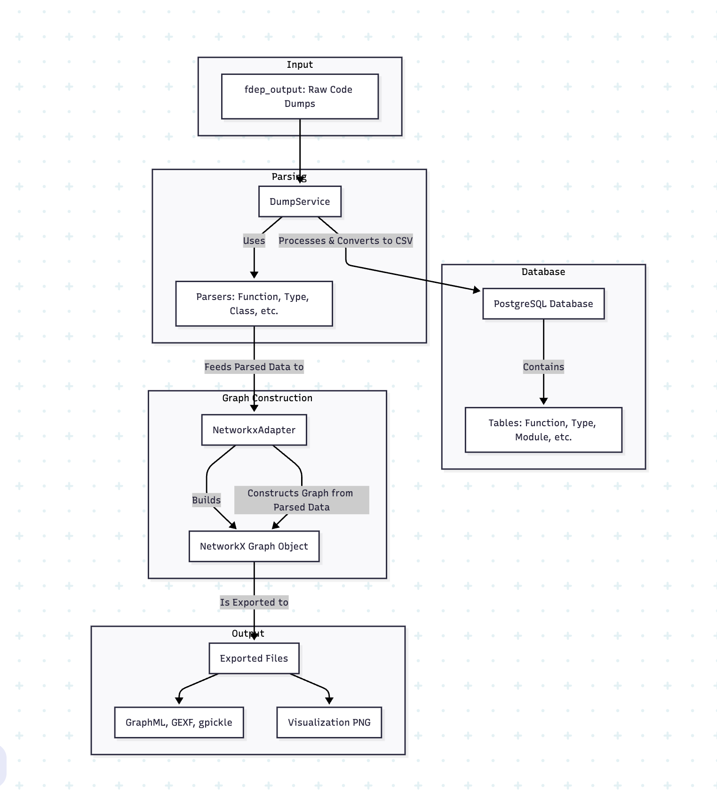

# Code as Data - Multi-Language Support

# SQL Query Guide for Code Analysis Database

This guide provides information on how to directly query the code analysis database using SQL without needing to write Python code. It includes:

- Database schema overview
- Table descriptions and relationships
- Common SQL query examples

NOTE: If your a dev then you might prefer going through <a href="https://www.postgresql.org/docs/](https://github.com/juspay/code-as-data/blob/main/readme-dev.md"> this </a>

## Supported Languages

This tool supports analysis of multiple programming languages:

- **Haskell**: Complete support via GHC Plugin Fdep
- **Rust**: Full integration with comprehensive analysis capabilities

The database schema accommodates both language-specific constructs and shared programming concepts.

## Architecture

The following diagram illustrates the complete data flow of the `code-as-data` repository, from raw code analysis dumps to the final, queryable graph outputs.



## Database Schema Overview

The database stores information about code components extracted from a codebase, including modules, functions, types, classes, instances, and their relationships.

### Tables and Relationships

<!--  -->


#### Main Tables

| Table | Description |
|-------|-------------|
| `module` | Code modules (files) |
| `function` | Functions defined in modules |
| `where_function` | Nested functions defined within other functions |
| `function_called` | Function calls made from functions or where_functions |
| `import` | Import statements in modules |
| `type` | Type definitions in the code |
| `constructor` | Constructors for types |
| `field` | Fields in constructors |
| `class` | Class definitions (Haskell) |
| `instance` | Instance definitions (Haskell) |
| `instance_function` | Associations between instances and functions (Haskell) |
| `trait` | Trait definitions (Rust) |
| `impl_block` | Implementation blocks (Rust) |
| `constant` | Constant definitions (Rust) |
| `trait_method_signature` | Method signatures in traits (Rust) |

#### Relationship Tables

| Table | Description |
|-------|-------------|
| `function_dependency` | Many-to-many relationships between caller and callee functions |
| `type_dependency` | Many-to-many relationships between types |

## Table Schemas

### Module Table

```sql
CREATE TABLE module (
    id INTEGER PRIMARY KEY,
    name VARCHAR(255),
    path VARCHAR(512)
);
```

### Function Table

```sql
CREATE TABLE function (
    id INTEGER PRIMARY KEY,
    name VARCHAR(255),
    function_signature TEXT,
    raw_string TEXT,
    src_loc VARCHAR(512),
    module_name VARCHAR(255),
    line_number_start INTEGER,
    line_number_end INTEGER,
    type_enum VARCHAR(512),
    module_id INTEGER REFERENCES module(id),
    -- Haskell-specific fields
    function_input JSON,
    function_output JSON,
    -- Rust-specific fields
    fully_qualified_path VARCHAR(512),
    is_method BOOLEAN,
    self_type VARCHAR(255),
    input_types JSON,
    output_types JSON,
    types_used JSON,
    literals_used JSON,
    methods_called JSON,
    visibility VARCHAR(50),
    doc_comments TEXT,
    attributes JSON,
    crate_name VARCHAR(255),
    module_path VARCHAR(512),
    impl_block_id INTEGER REFERENCES impl_block(id)
);
```

### Where Function Table

```sql
CREATE TABLE where_function (
    id INTEGER PRIMARY KEY,
    name VARCHAR(255),
    function_signature TEXT,
    raw_string TEXT,
    src_loc VARCHAR(512),
    parent_function_id INTEGER REFERENCES function(id) ON DELETE CASCADE
);
```

### Function Called Table

```sql
CREATE TABLE function_called (
    id INTEGER PRIMARY KEY,
    module_name VARCHAR(255),
    name TEXT,
    package_name VARCHAR(255),
    src_loc VARCHAR(512),
    _type TEXT,
    function_name TEXT,
    function_signature TEXT,
    type_enum TEXT,
    function_id INTEGER REFERENCES function(id) ON DELETE CASCADE,
    where_function_id INTEGER REFERENCES where_function(id) ON DELETE CASCADE
);
```

### Import Table

```sql
CREATE TABLE import (
    id INTEGER PRIMARY KEY,
    module_name VARCHAR(255),
    package_name VARCHAR(255),
    src_loc VARCHAR(512),
    is_boot_source BOOLEAN,
    is_safe BOOLEAN,
    is_implicit BOOLEAN,
    as_module_name VARCHAR(255),
    qualified_style VARCHAR(50),
    is_hiding BOOLEAN,
    hiding_specs JSON,
    line_number_start INTEGER,
    line_number_end INTEGER,
    module_id INTEGER REFERENCES module(id)
);
```

### Type Table

```sql
CREATE TABLE type (
    id INTEGER PRIMARY KEY,
    type_name VARCHAR(255),
    raw_code TEXT,
    src_loc VARCHAR(512),
    type_of_type VARCHAR(50),
    line_number_start INTEGER,
    line_number_end INTEGER,
    module_id INTEGER REFERENCES module(id)
);
```

### Constructor Table

```sql
CREATE TABLE constructor (
    id INTEGER PRIMARY KEY,
    name VARCHAR(255),
    type_id INTEGER REFERENCES type(id)
);
```

### Field Table

```sql
CREATE TABLE field (
    id INTEGER PRIMARY KEY,
    field_name VARCHAR(255),
    field_type_raw TEXT,
    field_type_structure JSON,
    constructor_id INTEGER REFERENCES constructor(id)
);
```

### Class Table

```sql
CREATE TABLE class (
    id INTEGER PRIMARY KEY,
    class_name VARCHAR(255),
    class_definition TEXT,
    src_location VARCHAR(512),
    line_number_start INTEGER,
    line_number_end INTEGER,
    module_id INTEGER REFERENCES module(id)
);
```

### Instance Table

```sql
CREATE TABLE instance (
    id INTEGER PRIMARY KEY,
    instance_definition TEXT,
    instance_signature TEXT,
    src_loc VARCHAR(512),
    line_number_start INTEGER,
    line_number_end INTEGER,
    module_id INTEGER REFERENCES module(id)
);
```

### Instance Function Table

```sql
CREATE TABLE instance_function (
    id INTEGER PRIMARY KEY,
    instance_id INTEGER REFERENCES instance(id),
    function_id INTEGER REFERENCES function(id)
);
```

### Function Dependency Table

```sql
CREATE TABLE function_dependency (
    caller_id INTEGER REFERENCES function(id),
    callee_id INTEGER REFERENCES function(id),
    PRIMARY KEY (caller_id, callee_id)
);
```

### Type Dependency Table

```sql
CREATE TABLE type_dependency (
    dependent_id INTEGER REFERENCES type(id),
    dependency_id INTEGER REFERENCES type(id),
    PRIMARY KEY (dependent_id, dependency_id)
);
```

### Rust-Specific Tables

#### Trait Table

```sql
CREATE TABLE trait (
    id INTEGER PRIMARY KEY,
    name VARCHAR(255),
    fully_qualified_path VARCHAR(512),
    src_location VARCHAR(512),
    module_name VARCHAR(255),
    module_id INTEGER REFERENCES module(id),
    module_path VARCHAR(512),
    crate_name VARCHAR(255)
);
```

#### Implementation Block Table

```sql
CREATE TABLE impl_block (
    id INTEGER PRIMARY KEY,
    struct_name VARCHAR(255),
    struct_fqp VARCHAR(512),
    trait_name VARCHAR(255),
    trait_fqp VARCHAR(512),
    src_location VARCHAR(512),
    module_id INTEGER REFERENCES module(id),
    trait_id INTEGER REFERENCES trait(id)
);
```

#### Constant Table

```sql
CREATE TABLE constant (
    id INTEGER PRIMARY KEY,
    name VARCHAR(255),
    fully_qualified_path VARCHAR(512),
    const_type JSON,
    src_location VARCHAR(512),
    src_code TEXT,
    line_number_start INTEGER,
    line_number_end INTEGER,
    module_id INTEGER REFERENCES module(id),
    visibility VARCHAR(50),
    attributes JSON,
    is_static BOOLEAN
);
```

#### Trait Method Signature Table

```sql
CREATE TABLE trait_method_signature (
    id INTEGER PRIMARY KEY,
    name VARCHAR(255),
    fully_qualified_path VARCHAR(512),
    input_types JSON,
    output_types JSON,
    src_location VARCHAR(512),
    src_code TEXT,
    line_number_start INTEGER,
    line_number_end INTEGER,
    module_name VARCHAR(255),
    visibility VARCHAR(50),
    attributes JSON,
    is_async BOOLEAN,
    is_unsafe BOOLEAN,
    trait_id INTEGER REFERENCES trait(id)
);
```

## Common SQL Queries

Here are some useful SQL queries to analyze the codebase:

### 1. List All Modules

```sql
SELECT id, name, path FROM module ORDER BY name;
```

### 2. Get Details for a Specific Module

```sql
SELECT * FROM module WHERE name = 'ModuleName';
```

### 3. List All Functions in a Module

```sql
SELECT f.id, f.name, f.function_signature, f.line_number_start, f.line_number_end
FROM function f
JOIN module m ON f.module_id = m.id
WHERE m.name = 'ModuleName'
ORDER BY f.line_number_start;
```

### 4. Find a Function by Name (Across All Modules)

```sql
SELECT f.id, f.name, m.name AS module_name, f.function_signature
FROM function f
JOIN module m ON f.module_id = m.id
WHERE f.name LIKE '%functionName%'
ORDER BY m.name, f.name;
```

### 5. Get Where Functions for a Specific Function

```sql
SELECT wf.id, wf.name, wf.function_signature
FROM where_function wf
JOIN function f ON wf.parent_function_id = f.id
WHERE f.name = 'functionName' AND f.module_id = (SELECT id FROM module WHERE name = 'ModuleName');
```

### 6. Find Function Dependencies (Function Calls)

```sql
-- Functions that call a specific function (callers)
SELECT caller.id, caller.name, m.name AS module_name
FROM function caller
JOIN function_dependency fd ON caller.id = fd.caller_id
JOIN function callee ON fd.callee_id = callee.id
JOIN module m ON caller.module_id = m.id
WHERE callee.name = 'functionName'
ORDER BY m.name, caller.name;

-- Functions called by a specific function (callees)
SELECT callee.id, callee.name, m.name AS module_name
FROM function callee
JOIN function_dependency fd ON callee.id = fd.callee_id
JOIN function caller ON fd.caller_id = caller.id
JOIN module m ON callee.module_id = m.id
WHERE caller.name = 'functionName'
ORDER BY m.name, callee.name;
```

### 7. Find the Most Called Functions

```sql
SELECT f.name, m.name AS module_name, COUNT(fd.caller_id) AS call_count
FROM function f
JOIN module m ON f.module_id = m.id
JOIN function_dependency fd ON f.id = fd.callee_id
GROUP BY f.id, f.name, m.name
ORDER BY call_count DESC
LIMIT 10;
```

### 8. Get Types Defined in a Module

```sql
SELECT t.id, t.type_name, t.type_of_type
FROM type t
JOIN module m ON t.module_id = m.id
WHERE m.name = 'ModuleName'
ORDER BY t.type_name;
```

### 9. Get Constructors and Fields for a Type

```sql
SELECT c.name AS constructor_name, f.field_name, f.field_type_raw
FROM constructor c
JOIN field f ON c.id = f.constructor_id
JOIN type t ON c.type_id = t.id
WHERE t.type_name = 'TypeName' 
  AND t.module_id = (SELECT id FROM module WHERE name = 'ModuleName')
ORDER BY c.name, f.field_name;
```

### 10. Find Imports in a Module

```sql
SELECT i.module_name AS imported_module, i.package_name, i.qualified_style
FROM import i
JOIN module m ON i.module_id = m.id
WHERE m.name = 'ModuleName'
ORDER BY i.module_name;
```

### 11. Find Cross-Module Dependencies

```sql
SELECT 
    caller_module.name AS caller_module, 
    callee_module.name AS callee_module, 
    COUNT(*) AS dependency_count
FROM function_dependency fd
JOIN function caller ON fd.caller_id = caller.id
JOIN function callee ON fd.callee_id = callee.id
JOIN module caller_module ON caller.module_id = caller_module.id
JOIN module callee_module ON callee.module_id = callee_module.id
WHERE caller_module.id != callee_module.id
GROUP BY caller_module.name, callee_module.name
ORDER BY dependency_count DESC;
```

### 12. Find Functions Calling a Specific Function

```sql
SELECT 
    caller.name AS caller_function, 
    caller_module.name AS caller_module,
    caller.src_loc
FROM function_dependency fd
JOIN function callee ON fd.callee_id = callee.id
JOIN function caller ON fd.caller_id = caller.id
JOIN module callee_module ON callee.module_id = callee_module.id
JOIN module caller_module ON caller.module_id = caller_module.id
WHERE callee.name = 'functionName' 
  AND callee_module.name = 'ModuleName';
```

### 13. Find Functions with Specific Patterns in Code

```sql
SELECT 
    f.name, 
    m.name AS module_name,
    f.src_loc
FROM function f
JOIN module m ON f.module_id = m.id
WHERE f.raw_string LIKE '%pattern%'
ORDER BY m.name, f.name;
```

### 14. Find Complex Functions (Based on Line Count)

```sql
SELECT 
    f.name, 
    m.name AS module_name, 
    f.line_number_end - f.line_number_start AS line_count
FROM function f
JOIN module m ON f.module_id = m.id
WHERE f.line_number_start > 0 AND f.line_number_end > 0
ORDER BY line_count DESC
LIMIT 20;
```

### 15. Find Functions with Most Dependencies (Outgoing Calls)

```sql
SELECT 
    f.name, 
    m.name AS module_name, 
    COUNT(fd.callee_id) AS outgoing_calls
FROM function f
JOIN module m ON f.module_id = m.id
JOIN function_dependency fd ON f.id = fd.caller_id
GROUP BY f.id, f.name, m.name
ORDER BY outgoing_calls DESC
LIMIT 20;
```

### 16. Find Classes with Their Module

```sql
SELECT 
    c.class_name, 
    m.name AS module_name, 
    c.src_location
FROM class c
JOIN module m ON c.module_id = m.id
ORDER BY m.name, c.class_name;
```

### 17. Find Instances and Their Functions

```sql
SELECT 
    i.instance_signature, 
    m.name AS module_name,
    f.name AS function_name
FROM instance i
JOIN module m ON i.module_id = m.id
JOIN instance_function if ON i.id = if.instance_id
JOIN function f ON if.function_id = f.id
ORDER BY m.name, i.instance_signature, f.name;
```

### 18. Find Function Call Hierarchy (Simple)

```sql
WITH RECURSIVE call_hierarchy AS (
    -- Base case: start with the specified function
    SELECT 
        f.id, 
        f.name, 
        m.name AS module_name, 
        0 AS depth
    FROM function f
    JOIN module m ON f.module_id = m.id
    WHERE f.name = 'rootFunctionName' AND m.name = 'ModuleName'
    
    UNION ALL
    
    -- Recursive case: get functions called by functions in hierarchy
    SELECT 
        callee.id, 
        callee.name, 
        callee_module.name AS module_name, 
        ch.depth + 1
    FROM call_hierarchy ch
    JOIN function_dependency fd ON ch.id = fd.caller_id
    JOIN function callee ON fd.callee_id = callee.id
    JOIN module callee_module ON callee.module_id = callee_module.id
    WHERE ch.depth < 3  -- Limit depth to avoid cycles
)
SELECT 
    REPEAT('  ', depth) || name AS function_name, 
    module_name, 
    depth
FROM call_hierarchy
ORDER BY depth, module_name, function_name;
```

### 19. Get Detailed Statistics About the Codebase

```sql
SELECT 
    'Modules' AS entity, COUNT(*) AS count FROM module
UNION ALL
SELECT 'Functions', COUNT(*) FROM function
UNION ALL
SELECT 'Where Functions', COUNT(*) FROM where_function
UNION ALL
SELECT 'Types', COUNT(*) FROM type
UNION ALL
SELECT 'Classes', COUNT(*) FROM class
UNION ALL
SELECT 'Instances', COUNT(*) FROM instance
UNION ALL
SELECT 'Traits (Rust)', COUNT(*) FROM trait
UNION ALL
SELECT 'Impl Blocks (Rust)', COUNT(*) FROM impl_block
UNION ALL
SELECT 'Constants (Rust)', COUNT(*) FROM constant
UNION ALL
SELECT 'Function Calls', COUNT(*) FROM function_dependency;
```

## Rust-Specific Queries

### 20. Find All Traits

```sql
SELECT t.name, t.fully_qualified_path, m.name AS module_name
FROM trait t
JOIN module m ON t.module_id = m.id
ORDER BY t.name;
```

### 21. Find Implementation Blocks for a Trait

```sql
SELECT ib.struct_name, ib.struct_fqp, m.name AS module_name
FROM impl_block ib
JOIN module m ON ib.module_id = m.id
WHERE ib.trait_name = 'Debug'
ORDER BY ib.struct_name;
```

### 22. Find Methods for a Struct

```sql
SELECT f.name, f.function_signature, f.visibility
FROM function f
JOIN impl_block ib ON f.impl_block_id = ib.id
WHERE ib.struct_name = 'MyStruct'
ORDER BY f.name;
```

### 23. Find Constants by Visibility

```sql
SELECT c.name, c.fully_qualified_path, c.visibility, m.name AS module_name
FROM constant c
JOIN module m ON c.module_id = m.id
WHERE c.visibility = 'pub'
ORDER BY c.name;
```

### 24. Find Functions with Specific Input/Output Types

```sql
-- Functions that take String as input
SELECT f.name, f.fully_qualified_path, m.name AS module_name
FROM function f
JOIN module m ON f.module_id = m.id
WHERE f.input_types::text LIKE '%String%'
ORDER BY f.name;

-- Functions that return Result type
SELECT f.name, f.fully_qualified_path, m.name AS module_name
FROM function f
JOIN module m ON f.module_id = m.id
WHERE f.output_types::text LIKE '%Result%'
ORDER BY f.name;
```

### 25. Find Trait Method Signatures

```sql
SELECT tms.name, tms.input_types, tms.output_types, t.name AS trait_name
FROM trait_method_signature tms
JOIN trait t ON tms.trait_id = t.id
WHERE t.name = 'Iterator'
ORDER BY tms.name;
```

### 26. Find All Structs that Implement Multiple Traits

```sql
SELECT ib.struct_name, COUNT(ib.trait_name) AS trait_count, 
       STRING_AGG(ib.trait_name, ', ') AS implemented_traits
FROM impl_block ib
WHERE ib.trait_name IS NOT NULL
GROUP BY ib.struct_name
HAVING COUNT(ib.trait_name) > 1
ORDER BY trait_count DESC;
```

## Connecting to the Database

You can connect to the PostgreSQL database using any standard SQL client or command line:

```bash
psql -h localhost -p 5432 -U postgres -d code_as_data
```

Default connection parameters (customize based on your .env file):

- Host: localhost
- Port: 5432  
- User: postgres
- Password: postgres
- Database: code_as_data

## Troubleshooting

If you encounter memory issues with large queries:

```sql
-- Increase work memory temporarily for large queries
SET work_mem = '256MB';
```

Performance optimization for frequent queries:

```sql
-- Create an index to speed up function name lookups
CREATE INDEX idx_function_name ON function(name);

-- Create an index for module lookups
CREATE INDEX idx_module_name ON module(name);
```

## NetworkX Graph Export

The tool includes a powerful NetworkX graph exporter that creates comprehensive graph representations of your codebase for advanced analysis and visualization.

### Graph Export Features

- **Multi-format export**: GraphML, GEXF, gpickle formats for different analysis tools

- **Multi-language support**: Works with both Haskell and Rust codebases
- **Professional visualization**: High-quality graph visualizations with proper categorization

### Usage

Export your codebase as a NetworkX graph:

```bash
# Basic usage with sample data
python scripts/export_networkx_graph.py --input fdep_output --output networkx_graph_exports --name my_codebase_graph

# Custom output directory and name
python scripts/export_networkx_graph.py --input fdep_output --output production_graphs --name hyperswitch_complete

# Skip visualization for faster processing
python scripts/export_networkx_graph.py --input fdep_output --name quick_export --no-viz
```

### Output Formats

The exporter creates multiple file formats for different use cases:

- **GraphML** (`.graphml`): Standard format for graph analysis tools like Gephi, Cytoscape
- **GEXF** (`.gexf`): Gephi native format with rich metadata
- **gpickle** (`.gpickle`): NetworkX native format for Python analysis
- **PNG** (`.png`): High-quality visualization (optional)

### Graph Statistics


### Command-Line Options

| Option | Description | Default |
|--------|-------------|---------|
| `--input`, `-i` | Input directory containing dump files | `fdep_output` |
| `--output`, `-o` | Output directory for graph files | `networkx_graph_exports` |
| `--name`, `-n` | Base name for output files | `codebase_graph` |
| `--no-viz` | Skip visualization generation | False |

### Integration with Analysis Tools

The exported graphs can be used with various analysis tools:

- **Gephi**: Use `.gexf` or `.graphml` files for interactive graph exploration
- **Cytoscape**: Import `.graphml` files for biological network-style analysis
- **NetworkX**: Load `.gpickle` files directly in Python for custom analysis
- **Graph databases**: Convert formats for Neo4j or other graph databases

## Additional Resources

For more advanced SQL queries and database management:

- [PostgreSQL Documentation](https://www.postgresql.org/docs/)
- [SQL Tutorial](https://www.w3schools.com/sql/)
- [NetworkX Documentation](https://networkx.org/documentation/stable/)
- [Gephi Graph Analysis](https://gephi.org/)
